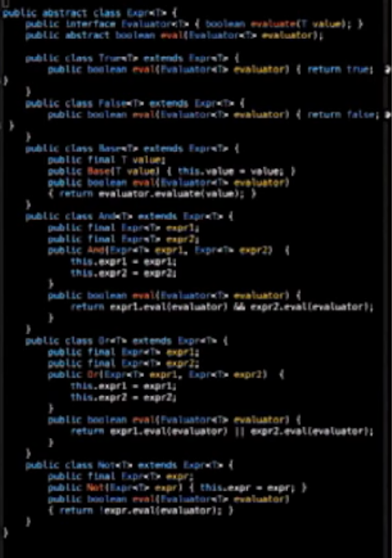

<!--
$theme: gaia
page_number: true
-->

# Haskell講座

---

# まず、Haskellをインストールしよう！

[Stackを入れよう](https://docs.haskellstack.org/en/stable/README/)

---

# 言語

|      | 手続き型                 | 関数型                         |
|------|--------------------------|--------------------------------|
| 動的 | |  |
| 静的 | |  |

---

# 言語

|      | 手続き型                 | 関数型                         |
|------|--------------------------|--------------------------------|
| 動的 | Python, Ruby, JavaScript |  |
| 静的 | |  |

---

# 言語

|      | 手続き型                 | 関数型                         |
|------|--------------------------|--------------------------------|
| 動的 | Python, Ruby, JavaScript |  |
| 静的 | C, C#, Java, C++, D      |  |

---

# 言語

|      | 手続き型                 | 関数型                         |
|------|--------------------------|--------------------------------|
| 動的 | Python, Ruby, JavaScript | Lisp, Scheme, Clojure, Erlang  |
| 静的 | C, C#, Java, C++, D      |  |

---

# 言語

|      | 手続き型                 | 関数型                         |
|------|--------------------------|--------------------------------|
| 動的 | Python, Ruby, JavaScript | Lisp, Scheme, Clojure, Erlang  |
| 静的 | C, C#, Java, C++, D      | OCaml, Scala, F#,  __Haskell__ |

---

# 和 in Python

```python
def sum(list):
  total = 0
  for num in list:
    total = total + num
  return total
```

---

# 和 in Haskell

```haskell
sum :: Num a => [a] -> a
sum [] = 0
sum (x:xs) = x + sum xs
```

---

# 和

```python
def sum(list):
  total = 0
  for num in list:
    total = total + num
  return total
```

```haskell
sum :: Num a => [a] -> a
sum [] = 0
sum (x:xs) = x + sum xs
```
手続き型言語で言う「変数」とHaskellで言う「変数」は別物

---

# mutability/stateは諸悪の根源

---

# 参照透過性

関数は同じ入力に対して必ず同じ値を返す。

---

# その他のHaskellの特徴

---

# 遅延評価

計算は必要になるまでされない。

```haskell
take 5 [1..]
```

---

# 強い型推論

---

# 簡潔性

```haskell
data Expr a
  = T
  | F
  | And (Expr a) (Expr a)
  | Or (Expr a) (Expr a)
  | Not (Expr a)
  | Base a

eval :: (a -> Bool) -> Expr a -> Bool
eval _ T = True
eval _ F = False
eval f (And x y) = (eval f x) && (eval f y)
eval f (Or x y) = (eval f x) || (eval f y)
eval f (Not a) = not (eval f a)
eval f (Base b) = f b
```

---



---

# 簡潔性

## C++ (30行)

```C++
template <typename T>
void qsort (T *result, T *list, int n)
{
    if (n == 0) return;
    T *smallerList, *largerList;
    smallerList = new T[n];
    largerList = new T[n];      
    T pivot = list[0];
    int numSmaller=0, numLarger=0;      
    for (int i = 1; i < n; i++)
        if (list[i] < pivot)
            smallerList[numSmaller++] = list[i];
        else 
            largerList[numLarger++] = list[i];
    
    qsort(smallerList,smallerList,numSmaller); 
    qsort(largerList,largerList,numLarger);
    
    int pos = 0;        
    for ( int i = 0; i < numSmaller; i++)
        result[pos++] = smallerList[i];
    
    result[pos++] = pivot;
    
    for ( int i = 0; i < numLarger; i++)
        result[pos++] = largerList[i];
    
    delete [] smallerList;
    delete [] largerList;
};
```

---

## Haskell (7行)

```haskell
qsort :: (Ord a) => [a] -> [a]
qsort [] = []
qsort (x:xs) =
  qsort less ++ [x] ++ qsort more
  where
    less = filter (<x)  xs
    more = filter (>=x) xs
```

---

# 文法

---

# 文法 - コメント

```haskell
-- コメントは2つのダッシュ記号
{- 複数行にまたがるコメントは
このようなブロックに囲む
-}
```

---

# 文法 - 数値

```haskell
-- 数字
3 -- 3

-- 四則演算は他の言語と変わらない
1 + 1 -- 2
8 - 1 -- 7
10 * 2 -- 20
35 /5 -- 7.0

-- 割り算結果は浮動小数点になる
35 / 4 -- 8.75

-- 整数結果の割り算
35 `div` 4 -- 8
```

---

# 文法 - 関数

```haskell
plus :: Int -> Int -> Int -- 型シグネチャ
plus a b = a + b -- 関数定義

plus 1 2 -- 3
1 `plus` 2 -- 3

1 + 2 -- 3
(+) 1 2 -- 3

(//) a b = a `div` b -- a // b = a `div` b でも可
35 // 4 -- 8
```

`a -> b -> c`は、`a`型と`b`型を引数として受け取り、`c`型を返す関数の型シグネチャ

---

# 文法 - カリー化・部分適用

```haskell
plus :: Int -> Int -> Int -- 型シグネチャ
plus a b = a + b -- 関数定義

increment :: Int -> Int
increment = plus 1
-- plus :: Int -> (Int -> Int)

increment 5 -- 6
```

`a -> b -> c`は、`a`型と`b`型を引数として受け取り、`c`型を返す関数の型シグネチャ
__であると同時に__`a`型を引数として受け取り、`b -> c`型(`b`型を引数として受け取り`c`型を返す関数)
を返す関数の型シグネチャでもある

---

# 文法 - 再帰・パターンマッチ

```haskell
factorial :: Int -> Int
factorial 0 = 1
factorial n = n * factorial (n - 1)
```

---

# 文法 - ブール値

```haskell
-- Bool値
True
False

-- 論理演算
not True -- False
not True -- False
not False -- True
1 == 1 -- True
1 /= 1 -- False
1 < 10 -- True
```

---

# 文法 - 文字と文字列

```haskell
"This is a string." -- 文字列([Char])
'a' -- 文字(Char)
-- 注意: 文字型と文字列型は違うため'Is this a string?'などは
-- エラーになる
```

---

# 文法 - リスト

```haskell
 -- リストの要素は全て同じ型である必要がある
[1, 2, 3, 4, 5]

-- レンジリスト
[1..5] -- [1, 2, 3, 4, 5]
['A'..'F'] -- "ABCDEF" 
[0,2..10] -- [0, 2, 4, 6, 8, 10]
[5,4..1] -- [5, 4, 3, 2, 1]
-- 注意: レンジではデフォルトでインクリメントするため、
-- [5..1]はエラーになる

-- リスト内要素へのアクセス
[1..10] !! 3 -- 4

-- 無限リスト
[1..] !! 999 -- 1000
```

---

# 文法 - 続・リスト

```haskell
-- リストの結合
[1..5] ++ [6..10] -- [1, 2, 3, 4, 5, 6, 7, 8, 9, 10]
-- 注意: 一つ目のリストの要素数をnとしてO(n)時間かかる

-- リストの先頭への追加
0:[1..5] -- [0, 1, 2, 3, 4, 5]
-- こちらはO(1)操作

head [1..5] -- 1
tail [1..5] -- [2, 3, 4, 5]
init [1..5] -- [1, 2, 3, 4]
last [1..5] -- 5

-- 内包表記
[x*2 | x <- [1..5]] -- [2, 4, 6, 8, 10]
[x*2 | x <- [1..5], x*2 > 4] -- [6, 8, 10]
```

---

# 文法 - 再帰・パターンマッチ再び

```haskell
sum :: [Int] -> Int
sum [] = 0
sum (x:xs) = x + sum xs
```

---

# 文法 - タプル

```haskell
-- タプルの各要素は異なる型であってもよいが、要素数は固定
("haskell", 1)

-- 長さ2のタプルへのアクセス
fst ("haskell", 1) -- "haskell"
snd ("haskell", 1) -- 1
```

---

# 今回はここまで

---

# 参考資料

- [Why OCaml - YouTube](https://www.youtube.com/watch?v=v1CmGbOGb2I)

- [Learn Haskell in Y Minutes](https://learnxinyminutes.com/docs/haskell/)

